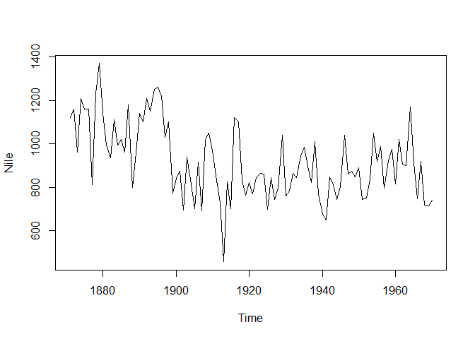

Assignment 1 - Exercise 2
================
Kevin Hu
11/09/2019

<!--above is YAML header-->

## Load required packages

``` r
library(datasets)
```

## Time Series of Annual Flow of the River Nile from 1871 to 1971

``` r
plot(Nile)
```

<!-- -->

## Descriptive Statistics of the Flow Data:

``` r
stat <- summary(Nile)
stat
```

    ##    Min. 1st Qu.  Median    Mean 3rd Qu.    Max. 
    ##   456.0   798.5   893.5   919.4  1032.5  1370.0

## Years below Average

``` r
belowmean <- Nile[Nile<stat[4]]
print(paste("There are",length(belowmean),"years that Nile River's annual flow was below the mean.",sep = " "))
```

    ## [1] "There are 57 years that Nile River's annual flow was below the mean."

<!--This is a comment-->
