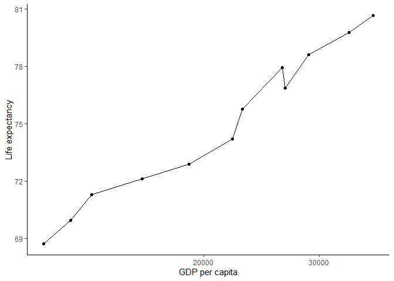
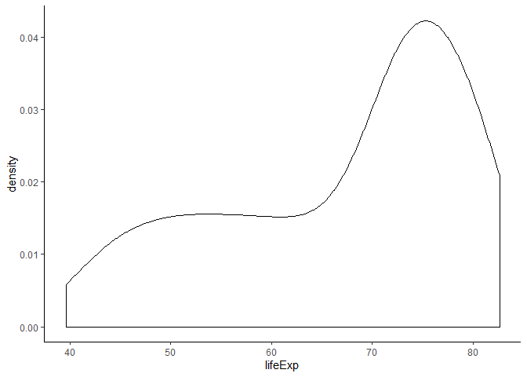
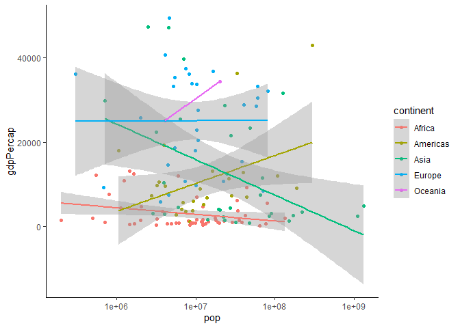
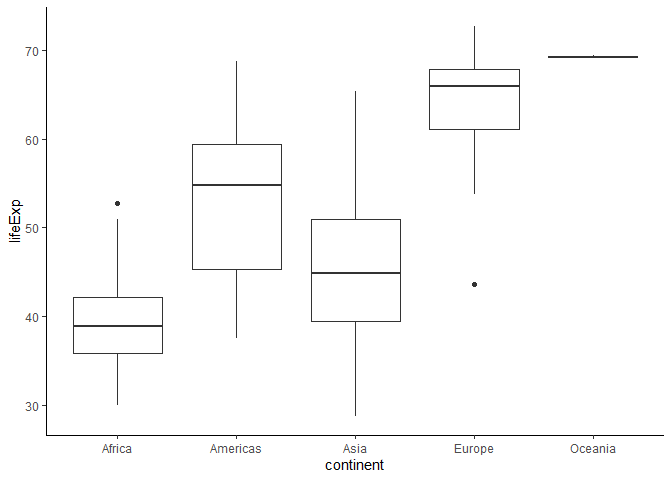

Assignment 2
================
Kevin Hu
19/09/2019

## Exercise 1: Basic dplyr

### 1.1 Use filter() to subset the gapminder data to three countries of your choice in the 1970’s.

``` r
gapminder %>% 
  filter(country == "Argentina" | country == "China" | country == "France",
        year > 1969 & year < 1980) %>% 
  arrange(year)
```

    ## # A tibble: 6 x 6
    ##   country   continent  year lifeExp       pop gdpPercap
    ##   <fct>     <fct>     <int>   <dbl>     <int>     <dbl>
    ## 1 Argentina Americas   1972    67.1  24779799     9443.
    ## 2 China     Asia       1972    63.1 862030000      677.
    ## 3 France    Europe     1972    72.4  51732000    16107.
    ## 4 Argentina Americas   1977    68.5  26983828    10079.
    ## 5 China     Asia       1977    64.0 943455000      741.
    ## 6 France    Europe     1977    73.8  53165019    18293.

### 1.2 Use the pipe operator %\>% to select “country” and “gdpPercap” from your filtered dataset in 1.1.

``` r
gapminder %>% 
  filter(country == "Argentina" | country == "China" | country == "France",
        year > 1969 & year < 1980) %>% 
  arrange(year) %>% 
  select(country, gdpPercap)
```

    ## # A tibble: 6 x 2
    ##   country   gdpPercap
    ##   <fct>         <dbl>
    ## 1 Argentina     9443.
    ## 2 China          677.
    ## 3 France       16107.
    ## 4 Argentina    10079.
    ## 5 China          741.
    ## 6 France       18293.

### 1.3 Filter gapminder to all entries that have experienced a drop in life expectancy. Be sure to include a new variable that’s the increase in life expectancy in your tibble. Hint: you might find the lag() or diff() functions useful.

``` r
gapminder %>% 
  mutate(diff_lifeExp = c(NA, diff(lifeExp, lag = 1, differences = 1))) %>% 
  filter(diff_lifeExp < 0) %>% 
  select(country, year, lifeExp, diff_lifeExp)
```

    ## # A tibble: 221 x 4
    ##    country     year lifeExp diff_lifeExp
    ##    <fct>      <int>   <dbl>        <dbl>
    ##  1 Albania     1992    71.6       -0.419
    ##  2 Algeria     1952    43.1      -33.3  
    ##  3 Angola      1952    30.0      -42.3  
    ##  4 Angola      1987    39.9       -0.036
    ##  5 Australia   1952    69.1       -6.20 
    ##  6 Austria     1952    66.8      -14.4  
    ##  7 Bahrain     1952    50.9      -28.9  
    ##  8 Bangladesh  1952    37.5      -38.2  
    ##  9 Benin       1952    38.2      -41.2  
    ## 10 Benin       2002    54.4       -0.371
    ## # ... with 211 more rows

### 1.4 Filter gapminder so that it shows the max GDP per capita experienced by each country.

``` r
gapminder %>% 
  group_by(country) %>% 
  arrange(desc(gdpPercap)) %>% 
  filter(gdpPercap == first(gdpPercap)) %>% 
  arrange(country)
```

    ## # A tibble: 142 x 6
    ## # Groups:   country [142]
    ##    country     continent  year lifeExp       pop gdpPercap
    ##    <fct>       <fct>     <int>   <dbl>     <int>     <dbl>
    ##  1 Afghanistan Asia       1982    39.9  12881816      978.
    ##  2 Albania     Europe     2007    76.4   3600523     5937.
    ##  3 Algeria     Africa     2007    72.3  33333216     6223.
    ##  4 Angola      Africa     1967    36.0   5247469     5523.
    ##  5 Argentina   Americas   2007    75.3  40301927    12779.
    ##  6 Australia   Oceania    2007    81.2  20434176    34435.
    ##  7 Austria     Europe     2007    79.8   8199783    36126.
    ##  8 Bahrain     Asia       2007    75.6    708573    29796.
    ##  9 Bangladesh  Asia       2007    64.1 150448339     1391.
    ## 10 Belgium     Europe     2007    79.4  10392226    33693.
    ## # ... with 132 more rows

### 1.5 Produce a scatterplot of Canada’s life expectancy vs. GDP per capita using ggplot2, without defining a new variable. That is, after filtering the gapminder data set, pipe it directly into the ggplot() function. Ensure GDP per capita is on a log scale.

``` r
gapminder %>% 
  filter(country == "Canada") %>% 
  ggplot(aes(gdpPercap, lifeExp))+
  labs(x = "GDP per capita", y = "Life expectancy")+
  scale_x_log10()+
  geom_point()+
  geom_line()+
  theme_classic()
```

<!-- -->

## Exercise 2: Explore individual variables with dplyr

### 2.1 What are possible values (or range, whichever is appropriate) of each variable?

For the “continent” variable, the possible values are:

``` r
levels(gapminder$continent)
```

    ## [1] "Africa"   "Americas" "Asia"     "Europe"   "Oceania"

For the “lifeExp” variable in 2007, the range is:

``` r
summary(gapminder$lifeExp[gapminder$year == 2007])[c(1,6)]
```

    ##   Min.   Max. 
    ## 39.613 82.603

### 2.2 What values are typical? What’s the spread? What’s the distribution? Etc., tailored to the variable at hand.

The distribution of the life expectancy world wide in 2007:

``` r
gapminder %>% 
  filter(year == 2007) %>% 
  ggplot(aes(lifeExp))+
  geom_density()+
  theme_classic()
```

<!-- -->

This distribution is skewed to the right. Thus, the mode could be
considered as a typical value.

``` r
life2007 <- gapminder %>% 
  filter(year == 2007) %>% 
  select(lifeExp)  
den <- density(life2007$lifeExp)
print(paste("The mode of this distribution is", round(den$x[which.max(den$y)],digits = 2), sep = " "))
```

    ## [1] "The mode of this distribution is 75.24"

Standard deviation is one of the measures of
spread.

``` r
print(paste("The mode of this distribution is", round(sd(life2007$lifeExp), digits = 2), sep = " "))
```

    ## [1] "The mode of this distribution is 12.07"

## Exercise 3: Explore various plot types

### 3.1 A scatterplot of two quantitative variables

``` r
gapminder %>%
  filter(year == 2007) %>% 
  ggplot(aes(pop, gdpPercap, colour = continent))+
  scale_x_log10()+
  geom_point()+
  stat_smooth(method = "lm")+
  theme_classic()
```

<!-- -->

### 3.2 One other plot besides a scatterplot

``` r
gapminder %>% 
  filter(year == 1952) %>% 
  ggplot(aes(continent, lifeExp))+
  geom_boxplot()+
  theme_classic()
```

<!-- -->
