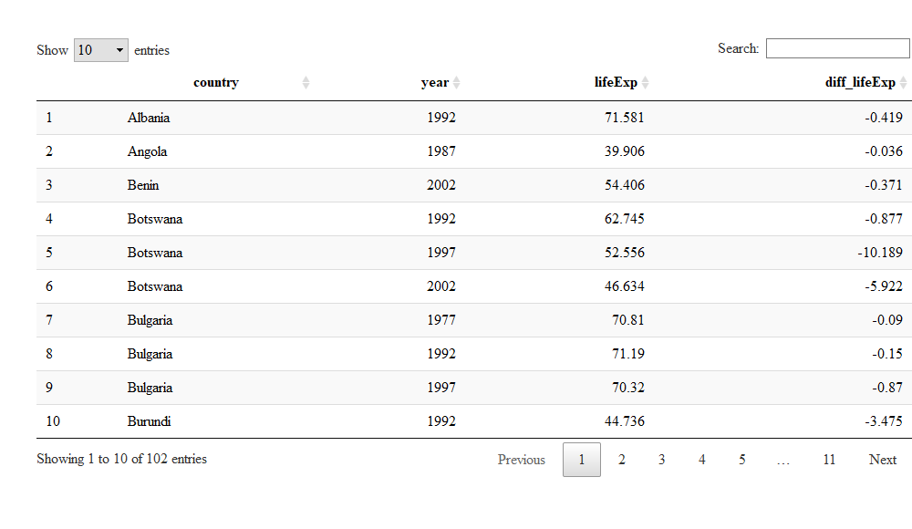
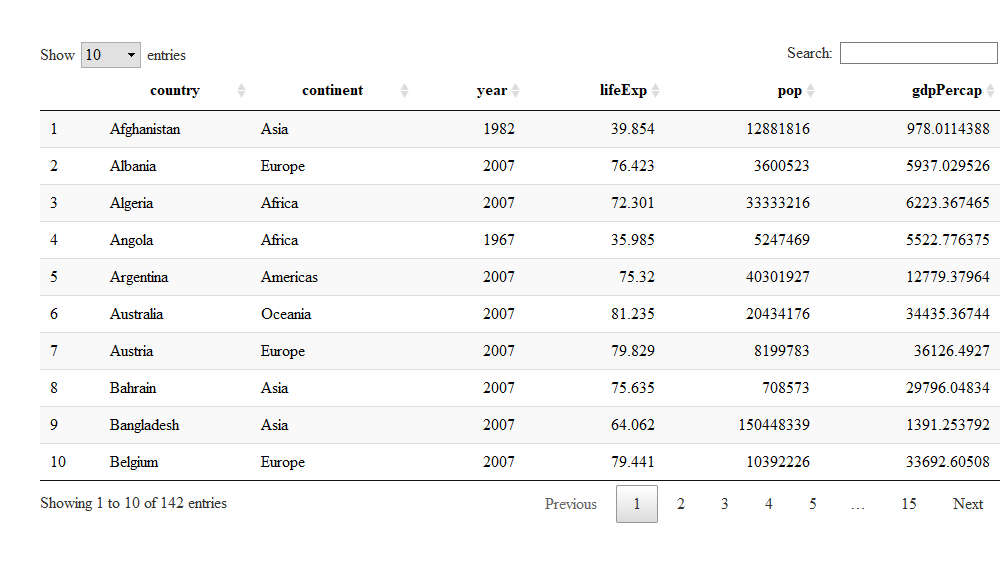

Assignment 2
================
Kevin Hu
19/09/2019

## Exercise 1: Basic dplyr

### 1.1 Use filter() to subset the gapminder data to three countries of your choice in the 1970’s.

``` r
gapminder %>% 
  filter(country == "Argentina" | country == "China" | country == "France",
        year > 1969 & year < 1980) %>% 
  arrange(year) %>% 
  knitr::kable()
```

| country   | continent | year |  lifeExp |       pop |  gdpPercap |
| :-------- | :-------- | ---: | -------: | --------: | ---------: |
| Argentina | Americas  | 1972 | 67.06500 |  24779799 |  9443.0385 |
| China     | Asia      | 1972 | 63.11888 | 862030000 |   676.9001 |
| France    | Europe    | 1972 | 72.38000 |  51732000 | 16107.1917 |
| Argentina | Americas  | 1977 | 68.48100 |  26983828 | 10079.0267 |
| China     | Asia      | 1977 | 63.96736 | 943455000 |   741.2375 |
| France    | Europe    | 1977 | 73.83000 |  53165019 | 18292.6351 |

### 1.2 Use the pipe operator %\>% to select “country” and “gdpPercap” from your filtered dataset in 1.1.

``` r
gapminder %>% 
  filter(country == "Argentina" | country == "China" | country == "France",
        year > 1969 & year < 1980) %>% 
  arrange(year) %>% 
  select(country, gdpPercap) %>% 
  knitr::kable()
```

| country   |  gdpPercap |
| :-------- | ---------: |
| Argentina |  9443.0385 |
| China     |   676.9001 |
| France    | 16107.1917 |
| Argentina | 10079.0267 |
| China     |   741.2375 |
| France    | 18292.6351 |

### 1.3 Filter gapminder to all entries that have experienced a drop in life expectancy. Be sure to include a new variable that’s the increase in life expectancy in your tibble. Hint: you might find the lag() or diff() functions useful.

``` r
gapminder %>% 
  group_by(country) %>% 
  mutate(diff_lifeExp = round((lifeExp - lag(lifeExp)),digits = 3)) %>% 
  ungroup() %>%
  filter(diff_lifeExp < 0) %>% 
  select(country, year, lifeExp, diff_lifeExp) %>% 
  DT::datatable()
```

<!-- -->

### 1.4 Filter gapminder so that it shows the max GDP per capita experienced by each country.

``` r
gapminder %>% 
  group_by(country) %>% 
  arrange(desc(gdpPercap)) %>% 
  filter(gdpPercap == first(gdpPercap)) %>% 
  arrange(country) %>% 
  DT::datatable()
```

<!-- -->

### 1.5 Produce a scatterplot of Canada’s life expectancy vs. GDP per capita using ggplot2, without defining a new variable. That is, after filtering the gapminder data set, pipe it directly into the ggplot() function. Ensure GDP per capita is on a log scale.

``` r
gapminder %>% 
  filter(country == "Canada") %>% 
  ggplot(aes(gdpPercap, lifeExp))+
  labs(x = "GDP per capita", y = "Life expectancy")+
  scale_x_log10()+
  geom_point()+
  geom_line()+
  theme_classic()
```

<!-- -->

## Exercise 2: Explore individual variables with dplyr

### 2.1 What are possible values (or range, whichever is appropriate) of each variable?

For the “continent” variable, the possible values are:

``` r
levels(gapminder$continent)
```

    ## [1] "Africa"   "Americas" "Asia"     "Europe"   "Oceania"

For the “lifeExp” variable in 2007, the range is:

``` r
summary(gapminder$lifeExp[gapminder$year == 2007])[c(1,6)]
```

    ##   Min.   Max. 
    ## 39.613 82.603

### 2.2 What values are typical? What’s the spread? What’s the distribution? Etc., tailored to the variable at hand.

The distribution of the life expectancy world wide in 2007:

``` r
gapminder %>% 
  filter(year == 2007) %>% 
  ggplot(aes(lifeExp))+
  geom_density()+
  theme_classic()
```

<!-- -->

This distribution is skewed to the right. Thus, the mode could be
considered as a typical value.

``` r
life2007 <- gapminder %>% 
  filter(year == 2007) %>% 
  select(lifeExp)  
den <- density(life2007$lifeExp)
print(paste("The mode of this distribution is", round(den$x[which.max(den$y)],digits = 2), sep = " "))
```

    ## [1] "The mode of this distribution is 75.24"

Standard deviation is one of the measures of
spread.

``` r
print(paste("The mode of this distribution is", round(sd(life2007$lifeExp), digits = 2), sep = " "))
```

    ## [1] "The mode of this distribution is 12.07"

## Exercise 3: Explore various plot types

### 3.1 A scatterplot of two quantitative variables

``` r
gapminder %>%
  filter(year == 2007) %>% 
  ggplot(aes(pop, gdpPercap, colour = continent))+
  scale_x_log10()+
  geom_point()+
  stat_smooth(method = "lm")+
  theme_classic()
```

<!-- -->

### 3.2 One other plot besides a scatterplot

``` r
gapminder %>% 
  filter(year == 1952) %>% 
  ggplot(aes(continent, lifeExp))+
  geom_boxplot()+
  theme_classic()
```

<!-- -->
